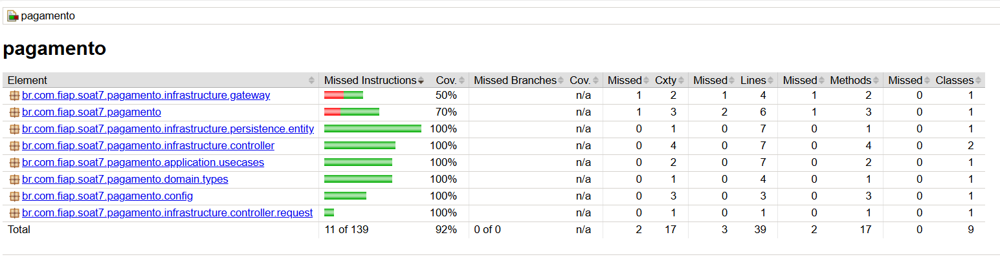
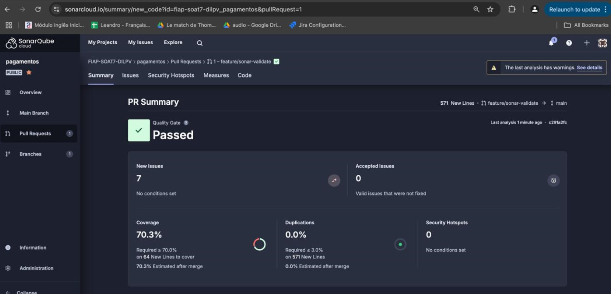

## Descrição

Tech Challenge da Fase 4 do curso Pós-Tech em Arquitetura de Software. Desenvolvimento de sistema de gerenciamento de pedidos para lanchonete em expansão.

Vídeo explicativo da aquitetura do projeto: [https://youtu.be/WHrUoj0jR2U](https://youtu.be/WHrUoj0jR2U)

## Grupo 55

- Darlan Talles de Oliveira Rodrigues - RM354780
- Isaque Dias Coelho - RM356260
- Leandro Shiniti Tacara - RM355388
- Pedro Paulo Dias Bertolini - RM354416
- Victor Filipe Corteze Caltabiano - RM355868

### Evidencias dos testes 

Relatório Jacoco: 



Sonar:
https://sonarcloud.io/summary/new_code?id=fiap-soat7-dilpv_pagamentos




## Infraestrutura

Para a construção da aplicação foram utilizadas as tecnologias:

- Java
- Spring Framework
- Banco de dados PostgreSQL
- Swagger para documentação das APIs


## Instalação minikube

#### COMO INSTALAR MINIKUBE UBUNTU
#### Baixar o instalador
curl -LO https://storage.googleapis.com/minikube/releases/latest/minikube-linux-amd64
Efetuar a instalação e remover o binario instalado

#### COMO INICIAR MINIKUBE
minikube start

#### BAIXANDO A VERSAO DE KUBECTL COMPATIVEL COM O MINIKUBE E HABILITAR PARA USO
minikube kubectl -- get po -A

#### CRIAR ATALHO PARA UTILIZAÇÃO DO KUBECTL DO MINIKUBE
alias kubectl="minikube kubectl --"

#### INSTALAR DASHBOARD DO MINIKUBE PARA VISUALIZAÇÃO DO AMBIENTE
nohup minikube dashboard > dashboard.log &

#### PARA ACESSAR O DASHBOARD
Ex: http://127.0.0.1:41405/api/v1/namespaces/kubernetes-dashboard/services/http:kubernetes-dashboard:/proxy/
* validar dentro do dashboard.log a porta de acesso, caso nao abra automaticamente

### Kubernetes namespace

#### CRIANDO NAMESPACE
kubectl create namespace soat7-lanchonete


#### CODIFICAR EM BASE64 OS VALORES DA SECRET
echo -n 'tech' | base64<br>
echo -n 'postgres' | base64<br>
echo -n 'root' | base64


#### CRIANDO SECRET
kubectl apply -f secret-db.yaml --namespace soat7-lanchonete

#### BUILD DE IMAGEM DA APP PARA DENTRO DO REPOSITORIO DO MINIKUBE
minikube image build -t lanchonete-soat7:2.0.0 .

#### CRIANDO PV
kubectl apply -f persistent-volume.yaml

#### CRIANDO PVC
kubectl apply -f persistent-volume-claim.yaml --namespace soat7-lanchonete

#### CRIAR OS DEPLOYMENTS
kubectl apply -f deployment-db.yaml --namespace soat7-lanchonete<br>
kubectl apply -f deployment-app.yaml --namespace soat7-lanchonete

#### CRIAR OS SERVICES
kubectl apply -f service-db.yaml --namespace soat7-lanchonete<br>
kubectl apply -f service-app.yaml --namespace soat7-lanchonete


#### HABILITAR NGINX NO MINIKUBE
minikube addons enable ingress

#### PARA CRIAR O INGRESS
kubectl apply -f ingress.yaml --namespace soat7-lanchonete

#### RECONHECER DOMINIO PELO IP DO MINIKUBE
echo $(minikube ip)'   soat7-tech-ch-2.fiap' | sudo tee -a /etc/hosts

#### AUMENTAR QUANTIDADE DE REPLICAS PARA 4 DA APP
kubectl scale --replicas=4 deployment.apps/lanchonete-deployment --namespace soat7-lanchonete

#### HABILITAR O MINIKUBE TUNEL
minikube tunnel

## ADICIONAIS
#### PARA ACESSAR O POD DA APP
kubectl exec --stdin --tty $(kubectl get pods --no-headers -o custom-columns=":metadata.name" -n soat7-lanchonete | grep lanchonete) --namespace soat7-lanchonete -- /bin/bash

#### PARA ACESSAR O POD DO BANCO
kubectl exec --stdin --tty $(kubectl get pods --no-headers -o custom-columns=":metadata.name" -n soat7-lanchonete | grep db) --namespace soat7-lanchonete -- /bin/bash


#### PARA VER OS LOGS DO POD DA APP
kubectl logs $(kubectl get pods --no-headers -o custom-columns=":metadata.name" -n soat7-lanchonete | grep lanchonete) -n soat7-lanchonete

#### PARA VER OS LOGS DO BANCO
kubectl logs $(kubectl get pods --no-headers -o custom-columns=":metadata.name" -n soat7-lanchonete | grep db) -n soat7-lanchonete


#### DESCOBRIR IP ATUAL DO CLUSTER DO MINKUBE

minikube ip

---- 

## Documentação do Sistema (DDD)

Para documenação dos fluxos foi criado um board na Miro onde foi desenhado o fluxo de negócio e disponibilizado o dicionário de linguagem ubiqua.


## Documentação do Sistema (DER - Diagrama de Entidade Relacionamento)
Para banco de dados optamos por utilizar PostgreSQL, e portanto, banco de dados relacional. A escolha se deu Além da afinidade e facilidade de integração com sistema, isso porque acreditamos que seria a tecnologia de armazanamento que mais satisfaria as necessidades do projeto, de dados bem estruturados e consistentes.


## Inicialização da aplicação

Para iniciar a aplicação foi disponibilizado um aquivo **docker-compose.yml** com as configurações necessárias para execução, incluindo o build da aplição em uma imagem Docker e um container para o banco de dados PostgreSQL.

Para inicializar a aplicação, rode o comando:

Para Mac ou Linux:
```bash
export POSTGRES_PASSWORD=root
export POSTGRES_USER=postgres
export POSTGRES_DB=tech

### Start docker-compose
docker-compose build --no-cache
docker compose up -d

### Status containers in docker-compose
docker-compose ps

### Stop docker-compose
docker-compose down
```

## Documentação das APIs

Para documentação das APIs utilizamos o framework Swagger. Após a inicialização da aplicação o mesmo fica disponível em [http://localhost:8080/swagger-ui/index.html#/](http://localhost:8080/swagger-ui/index.html#/), onde é possível realizar requisições para os endpoints através do mesmo.

Na própria página do Swagger é disponibilizado exemplos de requests.

## Recursos REST disponibilizados

- Criação e gerenciamento de pedidos

### Fluxo das APIs para criação de pedido

Os passos para testar a API são os seguintes:

1. Criar produtos <br>
    Na propriedade 'categoria' preencha com uma das opções validas:<br>
    - LANCHE<br>
    - ACOMPANHAMENTO<br>
    - BEBIDA<br>
    - SOBREMESA<br>
1. Criar cliente (opcional)
1. Criar pedido (Cliente ID no payload é opcional)
1. Confirmar pedido (Durante a confirmação será feito um 'fake checkout' e o pedido irá direto para o status de 'RECEBIDO')

Após esses passos, o pedido irá pra linha de produção da cozinha. O mesmo estará disponivel no endpoint de pedidos das cozinhas. A etapa em que o pedido está poderá ser atualizada usando o endpoint de atualizar etapa. Ao mudar o status pra "recebido", o pedido não retornará mais no endpoint da linha de produção da cozinha. Nessa etapa, o status do pedido pode ser mudado para os seguintes:

- `RECEBIDO`: O pagamento foi confirmado e está pronto para ser produzido
- `EM_PREPARACAO`: O pedido está sendo preparado
- `PRONTO`: O pedido está pronto e o cliente pode busca-lo
- `FINALIZADO`: O pedido foi entregue ao cliente

Para testar as APIs, utilize o Swagger diretamente ou pelo cliente de sua preferencia.